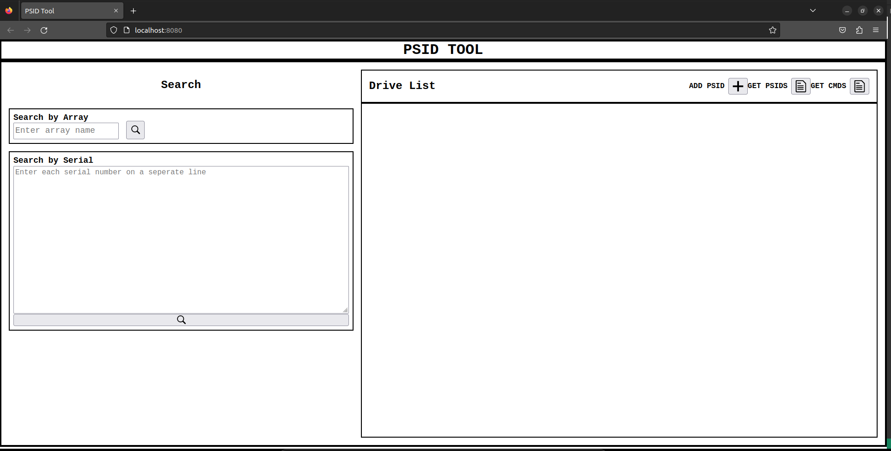

# PSID Lookup Tool V 1.0

DELL/EMC 2023

Justin C Kirk 2023

Fullstack app to handle CRUD operations for a database of NVME and MTC drives. 
Deployed to a virtual machine running [openSUSE](https://www.opensuse.org/).

## Parts:

- MySQL Database
    - Table for all possible array names for lab locations
    - Table for drives with columns for serial number, psid and foreign key to array name
    - See etl folder for files and scripts to build database
- Node JS Server
    - Acts as API to interface with database
    - Handles routes for POST, GET, PUT and DELETE requests
    - Serves browser GUI to client
- React JS Client
    - Can search single serial number or list of numbers
    - Can search by array name
    - Can edit drive info
    - Can delete drive
    - Lists all drives for serial number or array
    - Simple checks for input data
    - Can generate list of psids for displayed drives
    - Can copy individual serial numbers or psids
    - Can generate drive unlock commands
        - NOT YET IMPLEMENTED!
        - Sample bash scripts are provided in server/tools but need to be refactored
- Nginx Server
    - Acts as a reverse proxy server so app can be hosted on VM and accessed via url listed above.

Run server dev

    npm run server-dev

Node server should be running via [pm2](https://www.npmjs.com/package/pm2)

    pm2 start server/app.js

## Available requests:

Drive info for single serial

    GET /serials?serials=SERIAL_NUMBER
    
Drive info for a list of serials

    GET /serials?serials=SERIAL_1&serials=SERIAL_2&serials=SERIAL_3&...
    
Drive info for an array
    
    GET /array?arrayName=ARRAY_NAME

Add drive to database

    POST /drive

    body: {
        array: 'ARRAY_NAME',
        drives: [    
            { serial: 'SERIAL_1', psid: 'PSID_1' },
            { serial: 'SERIAL_2', psid: 'PSID_2' },
            { serial: 'SERIAL_3', psid: 'PSID_3' },
            ...
        ]
    }

Update drive info

    PUT /update

    body: {
        serialToUpdate: 'SERIAL_OF_DRIVE',
        serial: 'NEW_SERIAL',
        psid: 'NEW_PSID',
        arrayName: 'NEW_ARRAY_NAME'
    }

Delete a drive from database

    DELETE

        DELETE /serial
        body: { serial: 'SERIAL_OF_DRIVE' }

## ISSUES/BUGS

* Need to generate fake data sets to use as placeholder.
